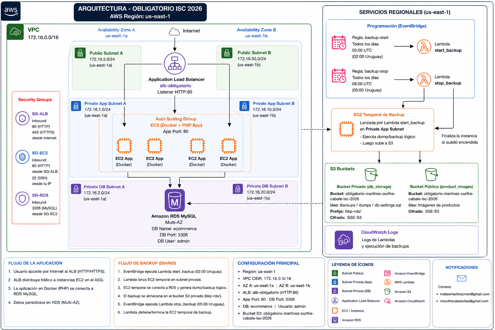

# 📦 Obligatorio ISC 2026 — N5A | Martínez · Ourthe · Cabalé

> Infraestructura como Código (IaC) sobre AWS usando Terraform modular.  
> Repositorio principal: [`mariourthecabale/Obligatorio_ISC_2026_N5A_Martinez_Ourthe_Cabale`](https://github.com/mariourthecabale/Obligatorio_ISC_2026_N5A_Martinez_Ourthe_Cabale)  
> Organización de módulos: [`ISC-2026-Martinez-Ourthe-Cabale`](https://github.com/ISC-2026-Martinez-Ourthe-Cabale)

---

## Tabla de contenidos

1. [Descripción general](#descripción-general)
2. [Diagrama de arquitectura general](#diagrama-de-arquitectura-general)
3. [Servicios de AWS utilizados](#servicios-de-aws-utilizados)
4. [Datos de la infraestructura](#datos-de-la-infraestructura)
5. [Firewalling / Security Groups](#firewalling--security-groups)
6. [Módulos Terraform](#módulos-terraform)
7. [Requisitos y dependencias](#requisitos-y-dependencias)
8. [Estructura del repositorio](#estructura-del-repositorio)
9. [Instructivo de uso](#instructivo-de-uso)
10. [Variables de entrada](#variables-de-entrada)
11. [Outputs](#outputs)
12. [Consideraciones de seguridad](#consideraciones-de-seguridad)
13. [Capturas de pruebas realizadas](#-capturas-de-pruebas-realizadas)
14. [Consultas IA](#-consultas-ia)

---

## Descripción general

Este proyecto despliega una aplicación web de e-commerce en alta disponibilidad sobre AWS, completamente definida como código con Terraform.  
La arquitectura está distribuida en **dos Availability Zones**, con separación de capas (pública / aplicación / base de datos), balanceo de carga automático, auto escalado de instancias EC2, base de datos MySQL administrada (RDS), y almacenamiento de backups en S3.

La aplicación corre en contenedores Docker sobre instancias EC2, la imagen se obtiene desde **GitLab Container Registry** (`registry.gitlab.com/mourthecabalediaz/app:1.0`).

---

## Diagrama de arquitectura general


## Diagrama de arquitectura detallado



**Flujo de tráfico:**

1. El usuario accede al DNS público del ALB por HTTP (puerto 80).
2. El ALB distribuye el tráfico hacia las instancias EC2 del Auto Scaling Group ubicadas en las subnets privadas de APP.
3. Las instancias EC2 se conectan a la base de datos RDS MySQL a través de la subnet privada de DB (puerto 3306).
4. Las instancias tienen salida a Internet únicamente a través del NAT Gateway (para descargar la imagen Docker desde GitLab Registry y actualizaciones del SO).

---

## Servicios de AWS utilizados

|Servicio|Uso|
|-|-|
|**VPC**|Red virtual privada que contiene toda la infraestructura|
|**Subnets**|2 públicas (ALB/NAT), 2 privadas APP (EC2), 2 privadas DB (RDS) — una por AZ|
|**Internet Gateway**|Salida a Internet desde subnets públicas|
|**NAT Gateway**|Salida a Internet desde subnets privadas (una por AZ)|
|**Elastic IP**|IPs estáticas para los NAT Gateways|
|**Route Tables**|Tablas de ruteo separadas para subnets públicas y privadas|
|**Application Load Balancer (ALB)**|Balanceo de carga HTTP entre instancias EC2|
|**Target Group**|Grupo de destino del ALB con health checks|
|**Auto Scaling Group (ASG)**|Escalado automático de instancias EC2 (mín 2, máx 4)|
|**Launch Template**|Configuración de las instancias EC2 (AMI, tipo, user data)|
|**EC2**|Instancias que ejecutan la aplicación en contenedores Docker|
|**RDS (MySQL 8.0)**|Base de datos relacional administrada|
|**DB Subnet Group**|Grupo de subnets privadas para RDS|
|**S3**|Bucket privado de backups + `db-settings.sql`, y bucket público de solo lectura para imágenes de productos|
|**Lambda**|Backup automático de RDS (lanza/apaga la instancia de backup) — ver módulo `db_backup`|
|**EventBridge (CloudWatch Events)**|Programa el horario diario de las Lambdas de backup (2am / 5am hora Uruguay)|
|**CloudWatch (Alarmas + Dashboard)**|Monitoreo de CPU/EC2, hosts no saludables y 5xx del ALB, CPU/almacenamiento de RDS|
|**SNS**|Notificaciones por email de las alarmas de CloudWatch|
|**DynamoDB**|Tabla de lock (`LockID`) para el backend remoto del tfstate|
|**Security Groups**|Firewall a nivel de instancia para ALB, EC2 y RDS|
|**IAM Instance Profile**|Perfil `LabInstanceProfile` para permisos de las instancias|

---

## Datos de la infraestructura

### Red (VPC y Subnets)

|Recurso|Variable|Valor típico / Descripción|
|-|-|-|
|VPC CIDR|`vpc_cidr`|Configurable por el operador (ej: `10.0.0.0/16`)|
|Availability Zones|`vpc_aws_az` / `vpc_aws_az_2`|Ej: `us-east-1a` / `us-east-1b`|
|Subnet Pública AZ1|`public_subnet`|CIDR pasado al módulo networking|
|Subnet Pública AZ2|`public_subnet_2`|CIDR pasado al módulo networking|
|Subnet Privada APP AZ1|`private_subnet_APP`|CIDR pasado al módulo networking|
|Subnet Privada APP AZ2|`private_subnet_APP_2`|CIDR pasado al módulo networking|
|Subnet Privada DB AZ1|`private_subnet_DB`|CIDR pasado al módulo networking|
|Subnet Privada DB AZ2|`private_subnet_DB_2`|CIDR pasado al módulo networking|

> Los CIDRs exactos deben definirse en el archivo `terraform.tfvars` al momento del despliegue.

### Cómputo (EC2 / ASG)

|Parámetro|Valor|
|-|-|
|AMI|Configurable (`ami` variable) — recomendada Amazon Linux 2023|
|Tipo de instancia|Configurable (`instance_type` en módulo ASG)|
|Capacidad mínima ASG|2 instancias|
|Capacidad máxima ASG|4 instancias|
|Capacidad deseada|2 instancias|
|IAM Instance Profile|`LabInstanceProfile`|
|Health check type|ELB|
|Ubicación|Subnets privadas APP (ambas AZs)|
|Software|Docker, Git, mariadb105 (cliente)|
|Imagen de la app|`registry.gitlab.com/mourthecabalediaz/app:1.0`|

### Base de datos (RDS)

|Parámetro|Valor por defecto|
|-|-|
|Motor|MySQL|
|Versión|8.0|
|Tipo de instancia|`db.t3.micro`|
|Almacenamiento inicial|20 GB|
|Almacenamiento máximo (autoscaling)|100 GB|
|Tipo de almacenamiento|`gp3`|
|Nombre de la base de datos|`ecommerce`|
|Puerto|`3306`|
|Acceso público|No (`publicly_accessible = false`)|
|Cifrado en reposo|Sí (`storage_encrypted = true`)|
|Multi-AZ|Configurable (por defecto `false`)|
|Backup automático|7 días de retención|
|Ventana de backup|`03:00–04:00` UTC|
|Ventana de mantenimiento|`sun:04:00–sun:05:00` UTC|
|Protección contra borrado|Configurable (por defecto `false`)|
|Actualizaciones menores automáticas|Sí|

### Load Balancer (ALB)

|Parámetro|Valor / Variable|
|-|-|
|Tipo|Application Load Balancer|
|Protocolo Listener|`listener_protocol` (ej: `HTTP`)|
|Puerto Listener|`listener_port` (ej: `80`)|
|Puerto Target Group|`target_group_port`|
|Protocolo Target Group|`target_group_protocol`|
|Health Check habilitado|`health_check_enabled`|
|Health Check path|`health_check_path`|
|Health Check protocol|`health_check_protocol`|
|Healthy threshold|`health_check_healthy_threshold`|
|Unhealthy threshold|`health_check_unhealthy_threshold`|
|Intervalo|`health_check_interval`|
|Timeout|`health_check_timeout`|
|Matcher (HTTP status)|`health_check_matcher`|

### Almacenamiento (S3)

|Parámetro|Valor|
|-|-|
|Bucket de backups|`bucket_name` (variable requerida) — privado, cifrado, versionado|
|Bucket de imágenes|`"${bucket_name}-images"` — público de solo lectura, fotos de productos|
|Propósito backups|Backups de RDS (prefijo `bkp-rds/`) y `db-settings.sql`|
|Propósito imágenes|Servir las fotos de `products.images` directamente vía URL HTTPS|

---

## Firewalling / Security Groups

La arquitectura implementa **tres Security Groups** con una cadena de acceso estricta:

### SG-ALB (Application Load Balancer)

|Dirección|Puerto|Protocolo|Origen|
|-|-|-|-|
|Ingress|80 (configurable)|TCP (configurable)|`0.0.0.0/0` (Internet)|
|Egress|Todo|Todos|`0.0.0.0/0`|

### SG-EC2 (Instancias del ASG)

|Dirección|Puerto|Protocolo|Origen|
|-|-|-|-|
|Ingress|80 (configurable vía `app_port`)|TCP|Solo desde **SG-ALB**|
|Egress|Todo|Todos|`0.0.0.0/0`|

> Las instancias EC2 **no son accesibles directamente desde Internet**. El único ingreso permitido proviene del ALB.

### SG-RDS (Base de datos MySQL)

|Dirección|Puerto|Protocolo|Origen|
|-|-|-|-|
|Ingress|3306 (configurable vía `db_port`)|TCP|Solo desde **SG-EC2**|
|Egress|Todo|Todos|`0.0.0.0/0`|

> La base de datos **no es accesible ni desde Internet ni desde el ALB**, únicamente desde las instancias de aplicación.

**Resumen del modelo de seguridad:**

```
Internet → [SG-ALB] → ALB → [SG-EC2] → EC2 → [SG-RDS] → RDS
```

---

## Módulos Terraform

Este repositorio actúa como **orquestador** que consume módulos alojados en la organización [`ISC-2026-Martinez-Ourthe-Cabale`](https://github.com/ISC-2026-Martinez-Ourthe-Cabale).

|Nombre del módulo|Repositorio fuente|Descripción|
|-|-|-|
|`networking`|`ISC-2026-Martinez-Ourthe-Cabale/module-networking`|VPC, subnets, IGW, NAT GW, route tables|
|`security_groups`|`ISC-2026-Martinez-Ourthe-Cabale/module-security-groups`|SG para ALB, EC2 y RDS|
|`alb`|`ISC-2026-Martinez-Ourthe-Cabale/module-alb`|ALB, Target Group, Listener|
|`ec2_asg`|`ISC-2026-Martinez-Ourthe-Cabale/module-asg`|Launch Template + Auto Scaling Group|
|`database`|`ISC-2026-Martinez-Ourthe-Cabale/module-database`|RDS MySQL + DB Subnet Group|
|`db_storage`|`ISC-2026-Martinez-Ourthe-Cabale/storage-backup`|Bucket S3 de backups (privado) + bucket S3 de imágenes de productos (público)|
|`db_backup`|`ISC-2026-Martinez-Ourthe-Cabale/module-db-backup`|Lambdas de backup automático de RDS (2am levanta EC2 y respalda, 5am apaga)|
|`monitoring`|`ISC-2026-Martinez-Ourthe-Cabale/module-monitoring`|Alarmas y dashboard de CloudWatch, notificaciones por SNS|
|`storage-backup`|`ISC-2026-Martinez-Ourthe-Cabale/storage-backup`|Buckets de S3 para scripts de sql, backups de RDS e imagenes de la ecommerce|


> Los módulos se referencian vía SSH (`git::ssh://git@github.com/...`). Requieren acceso SSH configurado con permisos a la organización.

### Módulo aparte: `module-tfstate-backend`

⚠️ **No se referencia desde `terraform/main.tf` como los demás.** [`ISC-2026-Martinez-Ourthe-Cabale/module-tfstate-backend`](https://github.com/ISC-2026-Martinez-Ourthe-Cabale/module-tfstate-backend) crea el bucket S3 (`tfstate-martinez-ourthecabale`) y la tabla DynamoDB (`terraform-state-lock`) donde vive el backend remoto del propio orquestador. Se aplica de forma standalone, una sola vez, con su propio state local — no puede ser un módulo común porque el bucket/tabla tienen que existir *antes* de poder usarse como backend (dependencia circular). Ver el paso 5 del [Instructivo de uso](#instructivo-de-uso) y el README de ese repositorio para el detalle completo.

---

## Requisitos y dependencias

### Software local requerido

|Herramienta|Versión mínima recomendada|Instalación|
|-|-|-|
|**Terraform**|`>= 1.3.0`|[terraform.io/downloads](https://developer.hashicorp.com/terraform/downloads)|
|**AWS CLI**|`>= 2.0`|[aws.amazon.com/cli](https://aws.amazon.com/cli/)|
|**Git**|`>= 2.30`|[git-scm.com](https://git-scm.com/)|
|**SSH**|Cualquier versión moderna|Incluido en Linux/macOS; en Windows usar OpenSSH o PuTTY|

### Credenciales y accesos necesarios

|Requisito|Detalle|
|-|-|
|**Cuenta AWS**|Con permisos suficientes para crear VPC, EC2, RDS, S3, ALB, IAM, etc.|
|**AWS credentials**|Configuradas vía `aws configure`, variables de entorno, o perfil de instancia|
|**Clave SSH en GitHub**|Para que Terraform pueda clonar los módulos vía `git::ssh://`|
|**GitLab Token**|Token de despliegue para pull de la imagen Docker (`registry.gitlab.com/mourthecabalediaz/app:1.0`)|
|**IAM Instance Profile**|`LabInstanceProfile` debe existir en la cuenta AWS antes del despliegue|

### Permisos AWS necesarios (mínimos)

El usuario o rol que ejecute Terraform debe tener permisos para gestionar: `ec2:*`, `rds:*`, `elasticloadbalancing:*`, `autoscaling:*`, `s3:*`, `dynamodb:*` (lock del backend), `lambda:*`, `events:*` (EventBridge, schedule de las Lambdas de backup), `logs:*` (CloudWatch Logs de las Lambdas), `iam:PassRole` (para el Instance Profile).

---

## Estructura del repositorio

```
Obligatorio_ISC_2026_N5A_Martinez_Ourthe_Cabale/
├── terraform/
│   ├── main.tf           # Orquestación de todos los módulos (incluye el provider "aws")
│   ├── variables.tf      # Declaración de variables de entrada
│   ├── output.tf         # Outputs (ALB DNS)
│   └── terraform.tfvars  # Valores concretos (NO commitear si tiene secretos)
├── .gitignore
├── LICENSE
└── README.md
```

> **Nota:** El directorio `terraform/` contiene el código HCL principal. Todos los comandos deben ejecutarse desde dentro de ese directorio.

---

## Instructivo de uso

### 1. Clonar el repositorio

```bash
git clone git@github.com:mariourthecabale/Obligatorio_ISC_2026_N5A_Martinez_Ourthe_Cabale.git
cd Obligatorio_ISC_2026_N5A_Martinez_Ourthe_Cabale/terraform
```


### 2. Crear el archivo de variables

Crear un archivo `terraform.tfvars` en el directorio `terraform/` con todos los valores requeridos:

```hcl
# Región y zonas de disponibilidad
aws_region   = "us-east-1"
vpc_aws_az   = "us-east-1a"
vpc_aws_az_2 = "us-east-1b"

# Red
vpc_cidr             = "10.0.0.0/16"
public_subnet        = "10.0.1.0/24"
public_subnet_2      = "10.0.2.0/24"
private_subnet_APP   = "10.0.10.0/24"
private_subnet_APP_2 = "10.0.11.0/24"
private_subnet_DB    = "10.0.20.0/24"
private_subnet_DB_2  = "10.0.21.0/24"

# Cómputo
ami         = "ami-XXXXXXXXXXXXXXXXX"   # Amazon Linux 2023 en us-east-1

# Base de datos
db_username = "admin"
db_password = "SuperSecreta123!"       # ¡Usar un valor seguro!
db_name     = "ecommerce"

# ALB
alb_name              = "obligatorio-alb"
listener_port         = 80
listener_protocol     = "HTTP"
target_group_port     = 80
target_group_protocol = "HTTP"

health_check_enabled             = true
health_check_path                = "/"
health_check_protocol            = "HTTP"
health_check_matcher             = "200"
health_check_interval            = 30
health_check_timeout             = 5
health_check_healthy_threshold   = 2
health_check_unhealthy_threshold = 3

# S3
bucket_name = "obligatorio-backup-XXXX"   # debe ser globalmente único

# GitLab
gitlab_token = "gldt-XXXXXXXXXXXX"         # Deploy token de GitLab

# Monitoreo (opcional)
notificacion_email = ["alguien@example.com"]   # vacío ([]) si no querés notificaciones por email
```

> ⚠️ **No commitear `terraform.tfvars` si contiene contraseñas o tokens.** Agregar al `.gitignore`.

### 3. Bootstrap del backend remoto (una sola vez por equipo)

El state de Terraform se guarda en S3 con lock por DynamoDB, no en un archivo local — así todo el equipo comparte el mismo state y no se pisan entre sí. Esto requiere un bootstrap separado, **una sola vez**, hecho por una sola persona:

```bash
cd ../../
git clone git@github.com:ISC-2026-Martinez-Ourthe-Cabale/module-tfstate-backend.git
cd module-tfstate-backend
terraform init
terraform plan --var-file="terraform.tfvars"
terraform apply --var-file="terraform.tfvars"
```

Esto crea el bucket `tfstate-martinez-ourthecabale` y la tabla DynamoDB `terraform-state-lock`. Son recursos que quedan **fuera** del ciclo de vida del resto de la infraestructura (no se gestionan desde `terraform/main.tf`). Más detalle en el README de [`module-tfstate-backend`](https://github.com/ISC-2026-Martinez-Ourthe-Cabale/module-tfstate-backend).

Si el bootstrap ya lo hizo otra persona del equipo, salteá este paso.

### 4. Conectar el orquestador al backend remoto

En `terraform/main.tf` ya está declarado (valores literales, un bloque `backend` no acepta variables):

```hcl
terraform {
  backend "s3" {
    bucket         = "tfstate-martinez-ourthecabale"
    key            = "obligatorio/terraform.tfstate"
    region         = "us-east-1"
    dynamodb_table = "terraform-state-lock"
    encrypt        = true
  }
}
```

Si ya tenías state local de una versión anterior de este repo:

```bash
terraform init -migrate-state
```

Responder `yes` cuando pregunte si copiar el state existente al backend nuevo. **Coordinar con el resto del equipo antes de este paso** — si una persona migra y otra sigue aplicando con state local viejo, vuelven a tener state divergente.

Si es la primera vez que se despliega este proyecto (no hay state previo), alcanza con el `terraform init` del paso siguiente.

### 5. Inicializar Terraform
Primero nos ubicamos en el repositorio principal:

```bash
cd ../../
cd Obligatorio_ISC_2026_N5A_Martinez_Ourthe_Cabale/terraform
```

Este paso descarga los módulos desde GitHub vía SSH:

```bash
terraform init
```

Si hay errores de clonación de módulos, verificar que la clave SSH tenga acceso a la organización `ISC-2026-Martinez-Ourthe-Cabale`. Si ya habías corrido `init` antes y los módulos cambiaron, usar `terraform init -upgrade` para forzar a traer las versiones más nuevas.

### 6. Validar terraform
```bash
terraform validate
```
### 7. Revisar el plan de ejecución

```bash
terraform plan --var-file="terraform.tfvars"
```

Revisar la salida para confirmar los recursos que se crearán antes de aplicar.

### 8. Aplicar la infraestructura

```bash
terraform apply --var-file="terraform.tfvars"
```

Escribir `yes` cuando se solicite confirmación. El proceso tarda aproximadamente **10–15 minutos** (la creación de RDS y el NAT Gateway son los recursos más lentos).

### 9. Obtener el DNS del ALB

Al finalizar, Terraform mostrará el DNS público del ALB:

```
Outputs:
alb_dns_name = "obligatorio-alb-XXXXXXXXXX.us-east-1.elb.amazonaws.com"
```

Acceder a esa URL desde el navegador para verificar que la aplicación responde.

### 10. Destruir la infraestructura

Cuando ya no se necesite el entorno:

```bash
terraform destroy
```

> ⚠️ Esto eliminará **todos** los recursos creados, incluyendo la base de datos. Si `skip_final_snapshot = false`, se creará un snapshot de RDS antes de borrar.

---
---
## Demostración del despliegue


---
## Variables de entrada

A continuación el detalle completo de todas las variables del módulo raíz:

|Variable|Tipo|Requerida|Default|Descripción|
|-|-|-|-|-|
|`aws_region`|`string`|✅|—|Región AWS donde desplegar|
|`vpc_cidr`|`string`|✅|—|CIDR block de la VPC|
|`vpc_aws_az`|`string`|✅|—|Primera Availability Zone|
|`vpc_aws_az_2`|`string`|✅|—|Segunda Availability Zone|
|`public_subnet`|`string`|✅|—|CIDR subnet pública AZ1|
|`public_subnet_2`|`string`|✅|—|CIDR subnet pública AZ2|
|`private_subnet_APP`|`string`|✅|—|CIDR subnet privada APP AZ1|
|`private_subnet_APP_2`|`string`|✅|—|CIDR subnet privada APP AZ2|
|`private_subnet_DB`|`string`|✅|—|CIDR subnet privada DB AZ1|
|`private_subnet_DB_2`|`string`|✅|—|CIDR subnet privada DB AZ2|
|`ami`|`string`|✅|—|ID de la AMI para las instancias EC2|
|`project_name`|`string`|❌|`"Obligatorio"`|Nombre del proyecto para tags|
|`alb_name`|`string`|✅|—|Nombre del ALB|
|`alb_ingress_cidr_blocks`|`list(string)`|❌|`["0.0.0.0/0"]`|CIDRs permitidos al ALB|
|`alb_ingress_port`|`number`|❌|`80`|Puerto de ingreso al ALB|
|`alb_ingress_protocol`|`string`|❌|`"tcp"`|Protocolo de ingreso al ALB|
|`listener_port`|`number`|✅|—|Puerto del Listener del ALB|
|`listener_protocol`|`string`|✅|—|Protocolo del Listener|
|`target_group_port`|`number`|✅|—|Puerto del Target Group|
|`target_group_protocol`|`string`|✅|—|Protocolo del Target Group|
|`health_check_enabled`|`bool`|✅|—|Habilitar health check|
|`health_check_path`|`string`|✅|—|Path del health check|
|`health_check_protocol`|`string`|✅|—|Protocolo del health check|
|`health_check_matcher`|`string`|✅|—|Código HTTP esperado|
|`health_check_interval`|`number`|✅|—|Intervalo entre checks (seg)|
|`health_check_timeout`|`number`|✅|—|Timeout del check (seg)|
|`health_check_healthy_threshold`|`number`|✅|—|Chequeos OK para marcar healthy|
|`health_check_unhealthy_threshold`|`number`|✅|—|Chequeos fallidos para unhealthy|
|`app_port`|`number`|❌|`80`|Puerto de la aplicación en EC2|
|`db_engine`|`string`|❌|`"mysql"`|Motor de base de datos|
|`db_engine_version`|`string`|❌|`"8.0"`|Versión del motor|
|`db_instance_class`|`string`|❌|`"db.t3.micro"`|Tipo de instancia RDS|
|`db_name`|`string`|❌|`"ecommerce"`|Nombre de la base de datos|
|`db_username`|`string`|✅|—|Usuario admin de la DB|
|`db_password`|`string`|✅|—|Contraseña admin de la DB|
|`db_port`|`number`|❌|`3306`|Puerto de la DB|
|`allocated_storage`|`number`|❌|`20`|Storage inicial en GB|
|`max_allocated_storage`|`number`|❌|`100`|Storage máximo en GB|
|`storage_type`|`string`|❌|`"gp3"`|Tipo de almacenamiento|
|`backup_retention_period`|`number`|❌|`7`|Días de retención de backups|
|`backup_window`|`string`|❌|`"03:00-04:00"`|Ventana de backup|
|`maintenance_window`|`string`|❌|`"sun:04:00-sun:05:00"`|Ventana de mantenimiento|
|`multi_az`|`bool`|❌|`false`|Habilitar RDS Multi-AZ|
|`skip_final_snapshot`|`bool`|❌|`false`|Omitir snapshot al destruir|
|`deletion_protection`|`bool`|❌|`false`|Proteger DB contra borrado|
|`bucket_name`|`string`|✅|—|Nombre del bucket S3 de backups (el bucket público de imágenes se deriva como `"${bucket_name}-images"`)|
|`gitlab_token`|`any`|✅|—|Token de despliegue de GitLab|
|`notificacion_email`|`list(string)`|❌|`[]`|Lista de emails que reciben las alertas de CloudWatch (vía SNS)|

---

## Outputs

|Output|Descripción|
|-|-|
|`alb_dns_name`|DNS público del Application Load Balancer para acceder a la aplicación|

---

## Consideraciones de seguridad

* **Secretos:** Las variables `db_password` y `gitlab_token` son sensibles. No commitearlas en texto plano. Usar variables de entorno (`TF_VAR_db_password`) o un gestor de secretos como AWS Secrets Manager.
* **State file:** El estado de Terraform (`terraform.tfstate`) contiene valores sensibles (incluye `db_password` y `gitlab_token` en texto plano). Se guarda en el bucket `tfstate-martinez-ourthecabale` (backend S3 + lock por DynamoDB), nunca en disco local ni en git — ver módulo `module-tfstate-backend`.
* **RDS no público:** La base de datos no tiene acceso público. El único acceso es desde las instancias EC2 del ASG.
* **NAT Gateway por AZ:** Cada AZ tiene su propio NAT Gateway, garantizando que la salida a Internet de las instancias privadas no dependa de una única AZ.
* **Cifrado RDS:** El almacenamiento de la base de datos está cifrado en reposo (`storage_encrypted = true`).

---
## 🧪 Capturas de pruebas realizadas

Este README contiene capturas de las pruebas que se realizaron pruebas de estrés.
 [`README_Evidencias`](./imagenes-de-pruebas/README.md).

---
## 🧪 Consultas IA
Este apartado contiene consultas realizadas a la IA.
[`Consultas-IA`](./consultasIA/utilización-de-IA.md).
---

*Proyecto académico — ISC 2026 — N5A | Martínez, Ourthe-Cabalé*

---


