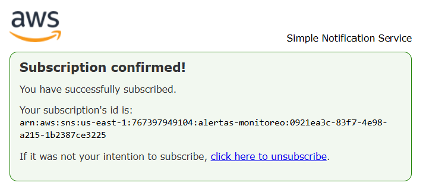
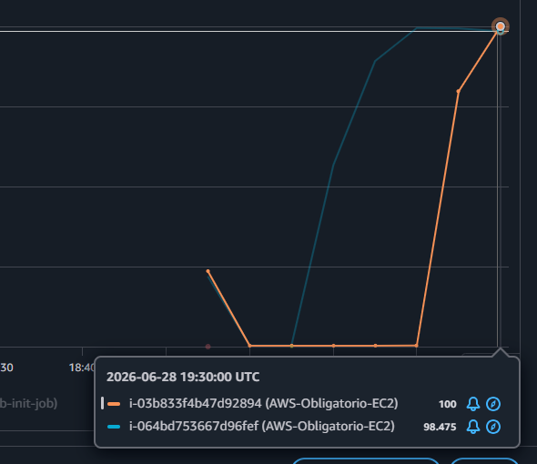
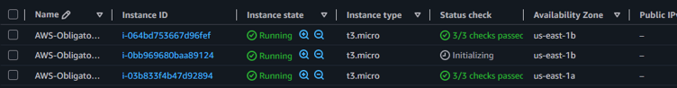

# 🧪 Capturas de pruebas realizadas

Evidencia de las pruebas hechas sobre la infraestructura ya desplegada: notificaciones de alarmas por correo (SNS), dashboards de CloudWatch, y autoescalado del ASG bajo carga de CPU.

---

## 1. Notificaciones por correo (SNS + CloudWatch Alarms)

### 1.1 Confirmación de suscripción a SNS

Paso previo necesario: al desplegar `module-monitoring` con un email en `notificacion_email`, SNS envía un correo de confirmación de suscripción. Hasta no confirmarlo (botón/link de la imagen), esa dirección no recibe ninguna alerta.

### 1.2 Email recibido al dispararse una alarma

Correo recibido cuando la alarma `AWS-Obligatorio-alb-unhealthy-hosts` pasó a estado **ALARM** (`UnHealthyHostCount` superó el umbral en 2 datapoints de 300 segundos). El cuerpo del mail incluye el detalle completo de la alarma: métrica monitoreada (`AWS/ApplicationELB` / `UnHealthyHostCount`), dimensiones (Target Group y Load Balancer), threshold y el motivo exacto del cambio de estado.

### 1.3 Email recibido al resolverse la alarma

Mismo mecanismo, pero para la transición inversa: **ALARM → OK**, una vez que el host volvió a estar saludable y la métrica dejó de superar el umbral. Confirma que el ciclo completo de alerta (subir y bajar) funciona en ambos sentidos, no solo al dispararse.

---

## 2. Dashboards de CloudWatch

### 2.1 Overview de alarmas por servicio

Vista general de CloudWatch mostrando las 5 alarmas del proyecto en estado **OK** (Application ELB, ElasticLoadBalancing, EC2, RDS, RDS Cluster), y el detalle de las dos más relevantes: `AWS-Obligatorio-alb-unhealthy-hosts` y `AWS-Obligatorio-ec2-cpu-utilizacion`, ya repuestas tras los disparos de prueba.

### 2.2 Métricas del Application Load Balancer

Dashboard específico del ALB: `RequestCount`, `HTTPCode_ELB_5XX_Count`, `ActiveConnectionCount`, `ConsumedLCUs`, entre otras. Sirve para correlacionar el tráfico real contra el ALB con los eventos de alarma y de autoescalado de las otras capturas.

### 2.3 Consola de EC2 — recursos y costo

Resumen de la consola de EC2: 3 instancias corriendo, 1 Auto Scaling Group, 1 Load Balancer, 5 Security Groups, 4 Elastic IPs (NAT Gateways) — y el costo acumulado de EC2 en la cuenta (US$0.12 en el período mostrado), útil para verificar que las pruebas no generaron gasto significativo.

---

## 3. Autoescalado del ASG por consumo de CPU

Prueba de la policy de target tracking al 70% de CPU (`cpu_target_value`), generando carga real sobre las instancias.

### 3.1 Picos de CPU durante la prueba de estrés

CPU de dos instancias del ASG (`i-03b833f4b47d92894` e `i-064bd753667d96fef`) subiendo a ~100% y ~98% respectivamente — resultado de generar carga manualmente (ver guion de prueba en `consultasIA/utilización-de-IA.md`, sección "Cómo estresar la CPU").

### 3.2 El ASG reacciona escalando una instancia nueva

Consecuencia directa del pico anterior: el Auto Scaling Group pasa de 2 a 3 instancias — la tercera (`i-0bb969680baa89124`) aparece con estado **Initializing**, recién lanzada por la policy de autoescalado al superarse el umbral de CPU sostenido.

---

*Capturas correspondientes a las pruebas de monitoreo y autoescalado del proyecto Obligatorio ISC 2026 — N5A | Martínez, Ourthe-Cabalé.*
